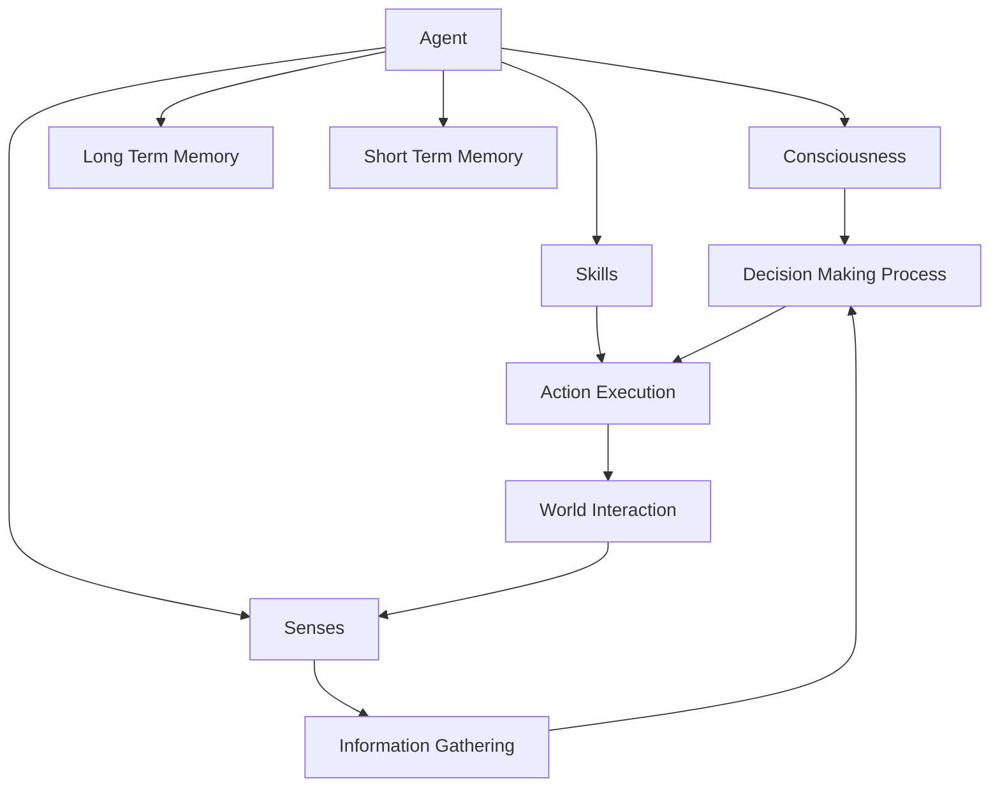

# SolúnikaAgent

## About
SolúnikaAgent is an experimental framework designed to simulate human-like interactions through a Large Language Model (LLM)-based agent. It facilitates the creation of custom agents equipped with unique tools and senses, enabling them to react and adapt dynamically to their environment. The flexible structure of SolúnikaAgent allows extensive customization and scalability, encouraging developers to explore innovative extensions.

## Introduction
The SolúnikaAgent model emulates human cognitive processes such as thinking, decision-making, planning, and acting. This experimental framework explores the feasibility of developing an agent that separates decision-making from external stimuli, creating a more autonomous artificial intelligence.

### Draft Architecture:


### Key Components:
- **Long Term Memory (LTM):** Stores all learned information, aiding the agent in informed decision-making.
- **Short Term Memory (STM):** Temporarily holds necessary data for immediate decision processes, which is discarded once a decision is made.
- **Consciousness:** Acts as the decision-making core of the agent.
- **Senses:** Gather information from the environment to inform decisions.
- **Skills:** Utilize tools to interact effectively with the environment and execute actions.

## Getting Started

### Prerequisites
- Node.js installed on your machine.

### Installation
Clone the repository and install dependencies:
```bash
git clone https://github.com/yourusername/SolúnikaAgent.git
cd SolúnikaAgent
npm install
```

### Usage

To deploy the SolúnikaAgent framework:

	1.	Create a new agent.
	2.	Define and integrate the desired senses, skills, and tools.
	3.	Initialize the agent with the following command:

	```bash
	node examples/test.js
	```


### Example	

Here is a simple example of how to set up and run a SolúnikaAgent:

```javascript
// Import the necessary classes and libraries
const { Agent, Sense, Skill } = require('SolúnikaAgent');

// Initialize the agent
let myAgent = new Agent("ExampleAgent");

// Add senses and skills
myAgent.addSense(new Sense("Vision"));
myAgent.addSkill(new Skill("Communication"));

// Execute the agent
myAgent.activate();
```

## Contributing
Contributions are welcome! If you’d like to contribute to SolúnikaAgent, please fork the repository and submit a pull request with your proposed changes.

## License

This project is licensed under the Apache License 2.0. It is free to use and modify for personal, academic, and commercial purposes, under the condition that all copies and substantial portions of the software must carry the original copyright and permission notice.

For more details, see the [LICENSE](LICENSE) file included with this project.

## Attribution

Users of this framework are required to give proper attribution by citing this project in their software documentation or publications as specified in the LICENSE file.

## Contact

For any questions or contributions, please open an issue or contact devops[ at ]Solúnika.com

## Acknowledgments

- Inspired by human cognitive processes
- Built on the foundation of Large Language Models
- Encourages innovation and exploration


## Project Status
SolúnikaAgent is currently in its experimental phase. We are actively seeking contributions and feedback to improve and expand the framework.

## About Us

Welcome to Solúnika.com, the forefront of scalable application development in Argentina. At Solúnika, we specialize in designing and developing robust software solutions that not only meet the evolving needs of businesses but also scale efficiently as they grow.

### Our Focus
Our core expertise lies in creating applications that are built to scale seamlessly across multiple dimensions, such as user load, data volume, and transaction frequency. We understand that in today’s dynamic business environment, scalability is as crucial as functionality.

### Security at Our Core
We place a strong emphasis on information security. Our development process integrates state-of-the-art security measures to ensure that every layer of the application is secure from potential threats. This includes implementing rigorous encryption practices, secure data storage solutions, and continuous security assessments to safeguard your data.

### Why Choose Us?
- **Expertise:** Deep knowledge and technical proficiency in application development.
- **Scalability:** Solutions designed to grow with your business.
- **Security:** A commitment to top-tier security practices to protect your information.

At Solúnika, we are committed to delivering excellence and driving innovation in every project we undertake. Join us on our journey to redefine software development with security and scalability at its core.

https://www.solunika.com
